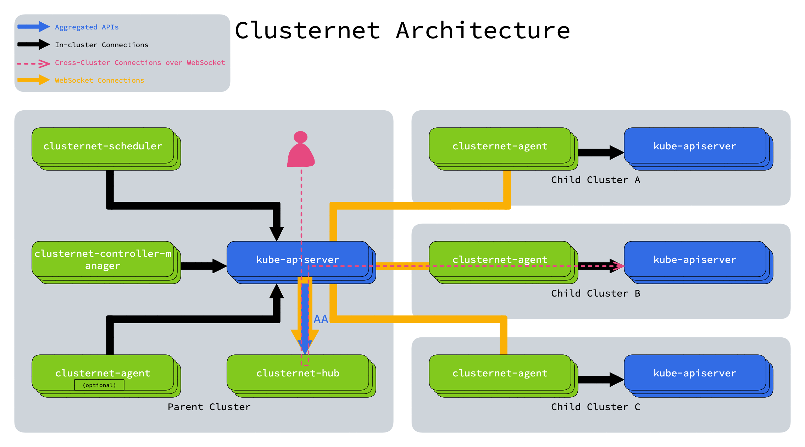

## Kubernetes多集群
为何需要多集群：
- 单个集群节点数量有限
- 企业采购或成本方面要求需要使用多家云供应商

Kubernetes多集群管理主要解决三类问题：
- 多Kubernetes集群管理
- 多集群中workload管理
- 多集群中Service通信

## 多集群开源项目
#### Clusternet

Clusternet 是由腾讯开源的一个轻量级插件，由clusternet-agent、clusternet-scheduler和clusternet-hub三个组件组成。

clusternet-agent 负责：
- 自动将当前集群注册到父集群作为子集群，也称为ManagedCluster
- 报告当前集群的心跳，包括Kubernetes版本、运行平台、healthz/readyz/livez、状态等
- 建立一个 websocket 连接，它通过单个 TCP 连接来提供全双工通信通道到父集群

clusternet-scheduler 负责：
- 基于SchedulingStrategy来调度资源/feeds到匹配的子集群

clusternet-hub 负责：
- 批准集群注册请求并为每个子集群创建专用资源，例如命名空间、服务帐户和 RBAC 规则
- 作为aggregated apiserver (AA) 服务。提供 shadow APIs，并用作 websocket 服务器，来维护子集群的多个活动 websocket 连接
- 提供 Kubernstes 风格的 API， 将请求重定向/代理/升级到每个子集群
- 利用 API， 协调和部署应用程序到多个集群

Clusternet核心逻辑类似于一个代理多个Kubernetes集群和兼容多个不同Kubernetes版本的适配层服务，clusternet中AA的作用，就是把k8s原生的api转换为AA中的映射api，例如pod存在apis/shadow/v1alpha1/pods下。所以客户端必须要进行改造，从原来使用k8s原生的api，变为使用clusternet专用的api。

#### Karmada
Karmada 的总体架构如下所示：

Karmada 控制平面包括以下组件：
- Karmada API Server
- Karmada Controller Manager
- Karmada Scheduler

- ETCD 存储了 karmada API 对象，API Server 是所有其他组件通讯的 REST 端点，Karmada Controller Manager 根据您通过 API 服务器创建的 API 对象执行操作。

Karmada Controller Manager 在管理面运行各种 Controller，这些 Controller 监视 karmada 对象，然后与成员集群的 API Server 通信以创建常规的 Kubernetes 资源。 
1. Cluster Controller：将 Kubernetes 集群连接到 Karmada，通过创建集群对象来管理集群的生命周期。
2. Policy Controller：监视 PropagationPolicy 对象。当添加 PropagationPolicy 对象时，Controller 将选择与 resourceSelector 匹配的一组资源，并为每个单独的资源对象创建 ResourceBinding。
3. Binding Controller：监视 ResourceBinding 对象，并为每个带有单个资源清单的集群创建一个 Work 对象。
4. Execution Controller：监视 Work 对象。当创建 Work 对象时，Controller 将把资源分发到成员集群。

## Karmada 详解
#### 跨集群网络
#### 跨集群Service通信

## 参考文档
- [浅谈开源集群联邦的设计和实现原理](https://cvvz.fun/post/kube-federation/)
- [Clusternet：一款开源的跨云多集群云原生管控利器！](https://juejin.cn/post/7056585357164281886)